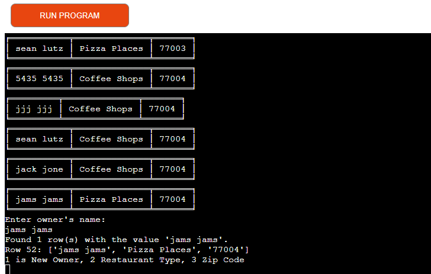

Welcome to Where To Restaurant, a Python-based terminal application designed to help you gauge where to buy, build or invest in a restaurant. With "Where To Restaurants” you will be able to find gaps in the restaurant market to help you better invest into the correct type of restaurant into the right location. We have created a database of total restaurant types within 10 zip codes. We give investors or restaurant owners the chance to access this information by adding themselves to our system. By using our system you will save money and time from performing research when looking for the right location to invest in a restaurant.

https://ui.dev/amiresponsive?url=https://wheretorestaurant-3bd31d04f4de.herokuapp.com

## UX

I used Simple Term Menu to give the menu color and style. For the Cursor I used purple. For the highting of the menu section
I used yellow. I made sure the user has an uncomplicated time using this app. by creating a list for the inputs.
I also used Tabulate to make the data more reader friendly. 

## User Stories

### New Site Users

- As a new site user, I would like to add my restaurant to the database, so that I can have access to the statistics database.
- As a new site user, I would like to edit the owner's name, because I bought a restaurant.
- As a new site user, I would like to run several searches in the database, so that I can find gaps in the market.

### Returning Site Users

- As a returning site user, I would like to edit my restaurant, so that I can change the type of restaurant.
- As a returning site user, I would like to view statistics, so that I can see where to invest into a new restaurant.
- As a returning site user, I would like to add a new restaurant, because I bought a new restaurant.

## Features

### Existing Features

- **Menu**
    -  Created a simple menu with colors to give the user easy navigation through the program. 

    -

- **Zip Code List**

    - This gives the User a list of the actual targeted Zip Codes.

 **Add New Restaurant**

- This gives the User the ability to gain access to the rest of the program and to update the database.

**View Statistics**

- This gives the User the ability to see where to invest or build a new restaurant.

**Edit Restaurants**

- This gives the User the ability change owner name, zip code, restaurant type.

### Future Features

- Wider Range of Zip Codes
    - This will give the user more options of locations for new restaurants.
- Statistics for demand per Zip Code.
    - This will give the users a clearer insight of what restaurant type to invest in.
- Convert information into graphs when applicable.
    - This gives the user a visual to help understand the information.
- The ability to Select a single row when editing restaurants.
   - This gives the user a better precision when editing .

## Tools & Technologies Used

- [Python](https://www.python.org) used as the back-end programming language.
- [GitHub](https://github.com) used for secure online code storage.
- [Gitpod](https://gitpod.io) used as a cloud-based IDE for development.
- [Google Sheets](https://www.google.com/sheets/about/) used as a cloud-based spreadsheet application .
- [Google API Client Libraries](https://developers.google.com/api-client-library) 
    - google-api-python-client: Provides the Python client library for Google APIs.
    - google-auth: Used for authenticating with Google services.
    - google-auth-httplib2: Provides HTTP request handling for Google API authentication.
    - google-auth-oauthlib: Offers OAuth 2.0 handling for Google API authentication.
- [Gspread](https://docs.gspread.org/en/v5.10.0/) used as a library for working with Google Sheets and Google Drive.
- [Simple Term Menu](https://pypi.org/project/simple-term-menu/) used for creating interactive terminal menus to facilitate user navigation within the application.
- [Heroku](https://www.heroku.com) used for hosting the deployed back-end site.

## Data Model

### Flowchart

To follow best practice, a flowchart was created for the app's logic,
and mapped out before coding began using a free version of
[Miro](https://miro.com/app/board/uXjVN29QBF4=/).

Below is the flowchart of the main process of this Python program. It shows the entire cycle of the program.

### Classes & Functions

The primary functions used on this application are:

- `clear()`
    - Purpose: Clears the terminal to not clog up the screen.
- `display_sheet_data()`
    - Purpose: Displays the data from the Gsheet.
- `display_sheet_rows(row_indices)`
    - Purpose: Display rows in the worksheet based on their indices.
- `find_rows_by_input(worksheet, search_value)`
    - Purpose: Find all rows in a worksheet containing the specified value.
- `edit_sheet_data(row_index, column_index, new_value)`
    - Purpose: Edits the data in the Gsheet at the specified row and column.
- `show_program_menu()`
    -  Purpose: Displays a menu using the TerminalMenu class from the simple_term_menu library.
- `load_valid_values(sheet_name, column_index)`
    - Purpose: Loads valid values from a specified Google Sheets column.
- `view_statistics()`
    - Purpose: Allows the user to view information about the number of restaurants of a specific type in a given zip code.
- `add_new_restaurant()`
    - Purpose: Adds a new restaurant to the Gsheet, collects input for owner name, restaurant type, and zip code, and appends the information to the Gsheet.
- `valid_owner_name_input(owner_input)`
    - Purpose: Validates the owner name input, ensuring that the owner name contains only letters and a single space.
- `get_valid_owner_name_input()`
    - Purpose: Retrieves valid owner name input from the user.
- `export_to_gsheets(owner_name, rest_type, zip_code)`
    - Purpose: Appends data to a Gsheet, uses the gspread library to authenticate, and appends a new row to a Google Sheet.
- `get_column_index_input()`
    -  Purpose: Prompts the user for input to select a column index.
- `get_new_input(index_input)`
    - Purpose: Takes a column index as input and returns corresponding user input based on the index.
- `select_zip_code_list()`
    - Purpose: Displays a list of zip codes and prompts the user to select one.
- `display_restaurant_types_list()`
    - Purpose: Displays a list of restaurant types and prompts the user to select one.
- `edit_restaurants()`
    - Purpose: Edits data in survey_q gsheet based on user input.
- `get_valid_owner_name_input()`
    - Purpose: Retrieves valid owner name input from the user.
- `main()`
    - Purpose: Run all program functions.

### Imports

I've used the following Python packages and/or external imported packages.

- `os`: used with the `clear()` function
- `time`: used to add minor delays
- `gspread`: used with the Google Sheets API
- `google.oauth2.service_account`: used for the Google Sheets API credentials
- `pprint`: used for debugging
- `simple_term_menu`: used for styling the menu
- `tabulate`: used tp organize incoming data from Gsheets

## Testing

For all testing, please refer to the [TESTING.md](TESTING.md) file.

## Deployment

Code Institute has provided a [template](https://github.com/Code-Institute-Org/python-essentials-template) to display the terminal view of this backend application in a modern web browser.
This is to improve the accessibility of the project to others.

The live deployed application can be found deployed on [Heroku](https://wheretorestaurant-3bd31d04f4de.herokuapp.com).

### Heroku Deployment

This project uses [Heroku](https://www.heroku.com), a platform as a service (PaaS) that enables developers to build, run, and operate applications entirely in the cloud.

Deployment steps are as follows, after account setup:

- Select **New** in the top-right corner of your Heroku Dashboard, and select **Create new app** from the dropdown menu.
- Your app name must be unique, and then choose a region closest to you (EU or USA), and finally, select **Create App**.
- From the new app **Settings**, click **Reveal Config Vars**, and set the value of KEY to `PORT`, and the value to `8000` then select *add*.
- If using any confidential credentials, such as CREDS.JSON, then these should be pasted in the Config Variables as well.
- Further down, to support dependencies, select **Add Buildpack**.
- The order of the buildpacks is important, select `Python` first, then `Node.js` second. (if they are not in this order, you can drag them to rearrange them)

Heroku needs two additional files in order to deploy properly.

- requirements.txt
- Procfile

You can install this project's **requirements** (where applicable) using:

- `pip3 install -r requirements.txt`

If you have your own packages that have been installed, then the requirements file needs updated using:

- `pip3 freeze --local > requirements.txt`

The **Procfile** can be created with the following command:

- `echo web: node index.js > Procfile`

For Heroku deployment, follow these steps to connect your own GitHub repository to the newly created app:

Either:

- Select **Automatic Deployment** from the Heroku app.

Or:

- In the Terminal/CLI, connect to Heroku using this command: `heroku login -i`
- Set the remote for Heroku: `heroku git:remote -a app_name` (replace *app_name* with your app name)
- After performing the standard Git `add`, `commit`, and `push` to GitHub, you can now type:
	- `git push heroku main`

The frontend terminal should now be connected and deployed to Heroku!

### Local Deployment

This project can be cloned or forked in order to make a local copy on your own system.

For either method, you will need to install any applicable packages found within the *requirements.txt* file.

- `pip3 install -r requirements.txt`.

If using any confidential credentials, such as `CREDS.json` or `env.py` data, these will need to be manually added to your own newly created project as well.

#### Cloning

You can clone the repository by following these steps:

1. Go to the [GitHub repository](https://github.com/primarypigments/new_restaurant) 
2. Locate the Code button above the list of files and click it 
3. Select if you prefer to clone using HTTPS, SSH, or GitHub CLI and click the copy button to copy the URL to your clipboard
4. Open Git Bash or Terminal
5. Change the current working directory to the one where you want the cloned directory
6. In your IDE Terminal, type the following command to clone my repository:
	- `git clone https://github.com/primarypigments/new_restaurant.git`
7. Press Enter to create your local clone.

Alternatively, if using Gitpod, you can click below to create your own workspace using this repository.

Please note that in order to directly open the project in Gitpod, you need to have the browser extension installed.
A tutorial on how to do that can be found [here](https://www.gitpod.io/docs/configure/user-settings/browser-extension).

#### Forking

By forking the GitHub Repository, we make a copy of the original repository on our GitHub account to view and/or make changes without affecting the original owner's repository.
You can fork this repository by using the following steps:

1. Log in to GitHub and locate the [GitHub Repository](https://github.com/primarypigments/new_restaurant)
2. At the top of the Repository (not top of page) just above the "Settings" Button on the menu, locate the "Fork" Button.
3. Once clicked, you should now have a copy of the original repository in your own GitHub account!

### Local VS Deployment

 There are no considerable differences that I have notice.

## Credits

### Content

| Source | Location | Notes |
| --- | --- | --- |
| [Markdown Builder](https://tim.2bn.dev/markdown-builder) | README and TESTING | tool to help generate the Markdown files |
| [Chris Beams](https://chris.beams.io/posts/git-commit) | version control | "How to Write a Git Commit Message" |
| [Stack Overflow]( https://stackoverflow.com/questions/59701452/how-to-update-cells-in-a-google-spreadsheet-with-python-s-gspread-wks-update-cel) | entire site | used to update a cell in gsheets. |
| [Real Python](https://realpython.com/python-enumerate/) | entire site | used for enumerate throughout the code. |
| [Geeks For Geeks](https://www.geeksforgeeks.org/loops-in-python/) | entire site | used as loops resource. |
| [Stack Overflow](https://stackoverflow.com/questions/60793155/gspread-append-row-appending-data-to-different-column) | entire site | used for appending data. |
| [Geeks For Geeks](]https://www.geeksforgeeks.org/python-lists/?ref=lbp) | entire site | used for python lists resource. |
| [W3Schools](https://www.w3schools.com/) | entire site | used for input validation methods. |
| [Docs.Gspread](https://docs.gspread.org/en/v6.0.0/user-guide.html) | entire site | used to figure out how to locate a specific cell in Gsheets. |
| [Digital Ocean](https://www.digitalocean.com/community/tutorials/python-valueerror-exception-handling-examples) | entire site | used for vauleerror thorughout my code. |
| [YouTube](https://www.youtube.com/watch?v=rfscVS0vtbw) | entire site | used for a tutorial for Getting Input From Users (48:26). |
| [ChatGPT](https://chat.openai.com/) | entire site | used for list contents (zip codes and restaurant types) understanding error messages, help with learning the correct vocabulary in commit messages. |

### Acknowledgements

- "I extend my heartfelt gratitude to my mentor at Code Institute, Tim Nelson, for their invaluable support during our calls for this project. Tim's guidance has been instrumental in shaping me into a more proficient programmer, and I am truly thankful for the wealth of knowledge and expertise shared. This project has been a tremendous learning experience, and I am grateful for Tim's mentorship that has contributed significantly to my growth as a developer."
- I would like to thank the [Code Institute](https://codeinstitute.net) tutor team for their assistance with troubleshooting and debugging some project issues.
- I would like to thank the [Code Institute Slack community](https://code-institute-room.slack.com) for the moral support; it kept me going during periods of self doubt and imposter syndrome.
- "I extend my sincere thanks to my partner, Coleen Sciacca, and my children for their unwavering belief in me and their support during my transition into software development. Their encouragement has been a driving force behind my journey, and I am grateful for the understanding and encouragement they have provided. Their belief in my abilities has made this transition smoother, and I look forward to sharing the successes ahead with them."
- "I express my gratitude to Agnetor für Arbeit for their steadfast support throughout my journey. Their assistance has been a crucial factor in my endeavors, and I am thankful for the support they have provided. Their encouragement has played a significant role in my journey, and I appreciate their commitment to assisting me on this path."
