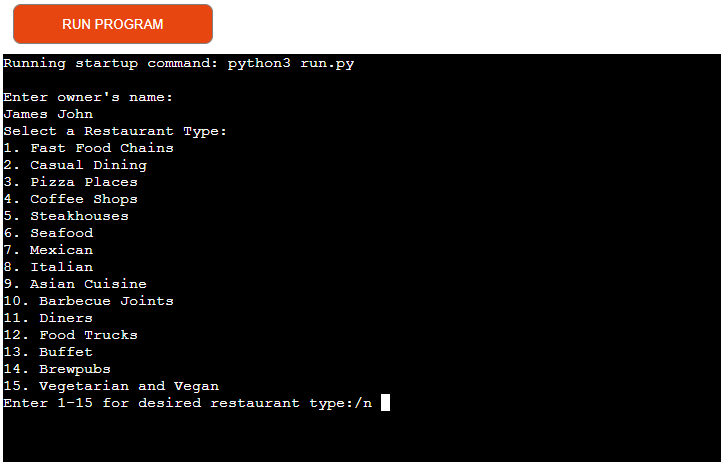
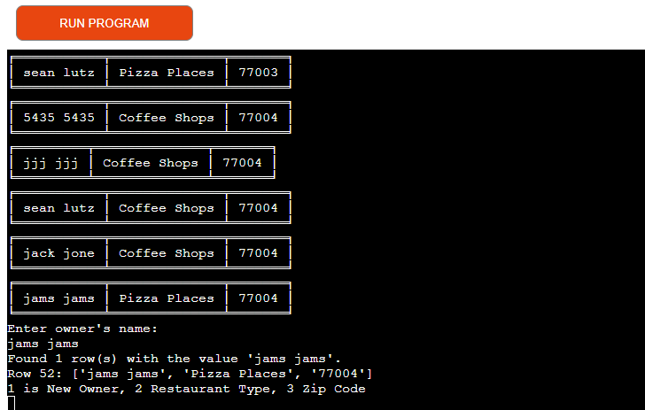
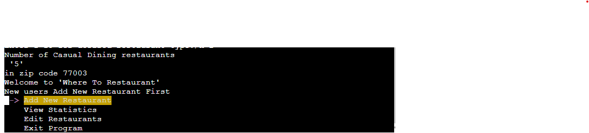

# Testing

Return back to the [README.md](README.md) file.

## Code Validation

### Python

I have used the recommended [PEP8 CI Python Linter](https://pep8ci.herokuapp.com) to validate all of my Python files.

| File | CI URL | Screenshot | Notes |
| --- | --- | --- | --- |
| run.py | [PEP8 CI](https://pep8ci.herokuapp.com/https://raw.githubusercontent.com/primarypigments/new_restaurant/main/run.py) |  | Pass: No Errors |

## Browser Compatibility

I've tested my deployed project on multiple browsers to check for compatibility issues.

| Browser | Screenshot | Notes |
| --- | --- | --- |
| Chrome |  | Works as expected |
| Firefox |  | Works as expected |
| Edge |  | Works as expected |
| Brave |  | Works as expected |
| Opera |  | Minor differences |

## Defensive Programming

| Page | User Action | Expected Result | Pass/Fail | Screenshot |
| --- | --- | --- | --- | --- |
| Home | | | | |
| | Enter on Add New Restaurant | Add owner name screen | Pass | 
| | Enter on View Statistics | Check for existing owner screen | Pass | 
| | Enter on Edit Restaurant | Load spreadsheet screen | Pass | |
| | Enter on Exit Program | Exit Program | Pass | |
| Add New Restaurant | | | | |
| | Enter Owner Name | Field will only accept a string with one space, no numbers, no special characters, not none | Pass |  |
| | Zip Code List | Field will only accept a number 1-10 | Pass |  |
| | Restaurant Type List | Field will only accept a number 1-15 | Pass |  |
| View Statistics | | | | |
| | Enter Owner Name | Field will only an existing Owner Name, a string with one space, no numbers, no special characters, not none | Pass |  |
| | Zip Code List | Field will only accept a number 1-10 | Pass |  |
| | Restaurant Type List | Field will only accept a number 1-15 | Pass |  |
| | Print Statistics | Field will print statistics | Pass | 
| Edit Restaurant | | | | |
| | Enter Owner Name | Field will only accept an existing Owner Name, a string with one space, no numbers, no special characters, not none | Pass |  |
| | Edit Options| Field will only accept 1,2,3 | Pass |  |
| | Enter Owner Name Option 1| Field will only accept a string with one space, no numbers, no special characters, not none | Pass |  |
| | Restaurant Type List Option 3 | Field will only accept a number 1-15 | Pass |  |
| | Zip Code List Option 3| Field will only accept a number 1-10 | Pass |  |

## User Story Testing

| User Story | Screenshot |
| --- | --- |
| As a new site user, I would like to add my restaurnt to the database, so that I can have access to the statistic database. | 
| As a new site user, I would like to edit the owner name, because I bought a restaurant. | 
| As a new site user, I would like to run several searches in the database, so that I can find gaps in the market. | 
| As a returning site user, I would like to edit my restuarant, so that I can change the type of restaurant. | 
| As a returning site user, I would like to view statistics, so that I can see where to invest into a new resturant. | 
| As a returning site user, I would like to add a new restaurant, becuase I bought a new restaurant. | 

## Bugs

- Python `Appending the first input even though it was an invalid input` 

    

    - To fix this, I combined the Owner validation functions to ensure that the validation works as expected. This was a compbined effort with the help of the Tutor team.

- Python `E501 line too long` (125 > 79 characters)

    

    - To fix this, I separated the "print" into multiple "print" lines.

- Python `AttributeError: 'NoneType' object has no attribute 'lower'` 

    

    - To fix this, I made sure there are no extra spaces in the user's input, validate the owner's name, and ensure it's converted to lowercase only when there's a valid input.
    
## Unfixed Bugs

- After, adding a restaurant and hitting enter to return to them menu, you have to hit enter on the menu option you selected 2 times for it to proceed.

    

    - Attempted fix: I tried to adjust the terminal size, but it only resizes the actual terminal, not the allowable area for text.

