# Testing

Return back to the [README.md](README.md) file.

## Code Validation

### Python

I have used the recommended [PEP8 CI Python Linter](https://pep8ci.herokuapp.com) to validate all of my Python files.

| File | CI URL | Screenshot | Notes |
| --- | --- | --- | --- |
| run.py | [PEP8 CI](https://pep8ci.herokuapp.com/https://raw.githubusercontent.com/primarypigments/new_restaurant/main/run.py) | 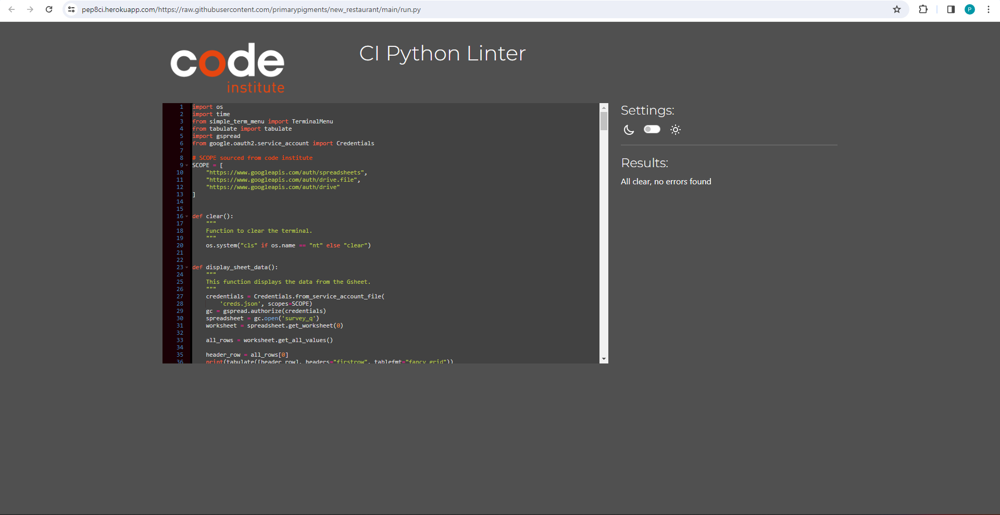 | Pass: No Errors |

## Browser Compatibility

I've tested my deployed project on multiple browsers to check for compatibility issues.

| Browser | Home | About | Contact | etc | Notes |
| --- | --- | --- | --- | --- | --- |
| Chrome | 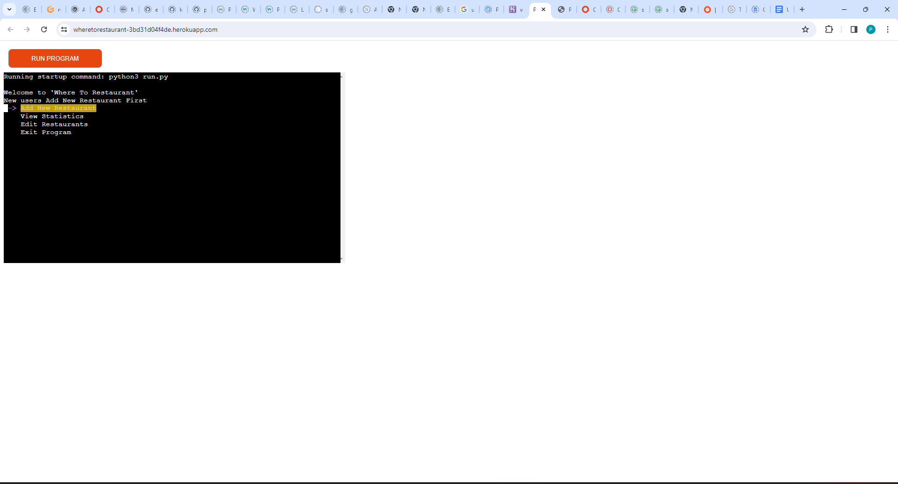 |  | Works as expected |
| Firefox | 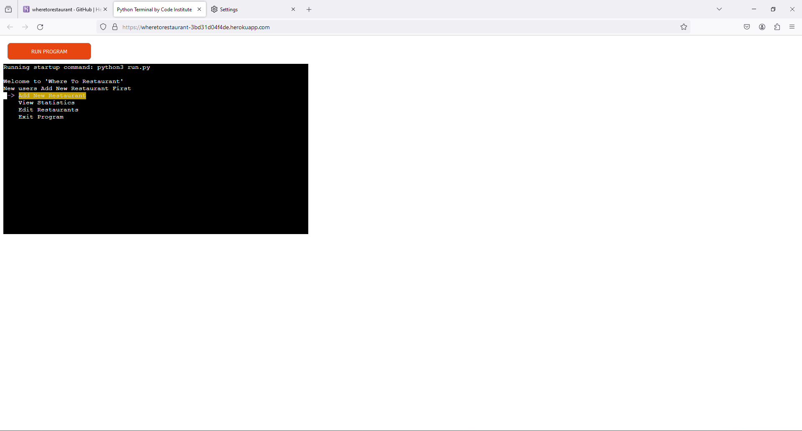 |  | Works as expected |
| Edge | 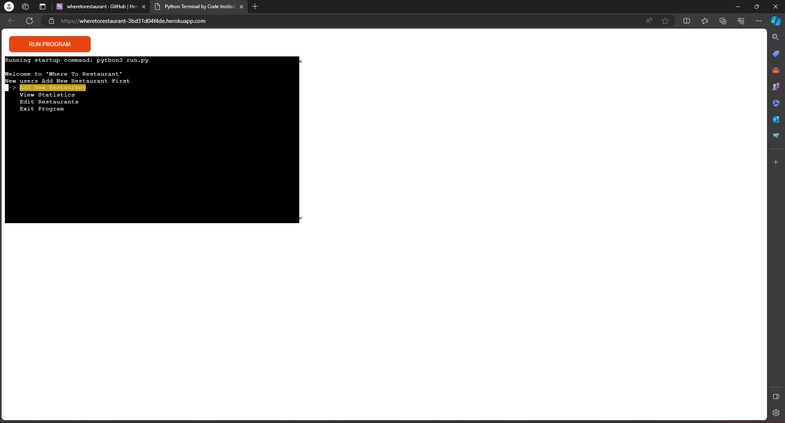 |  | Works as expected |
| Safari |  |  |  |  | Minor CSS differences |
| Brave | 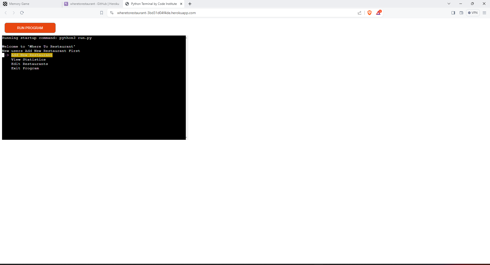 |  | Works as expected |
| Opera | 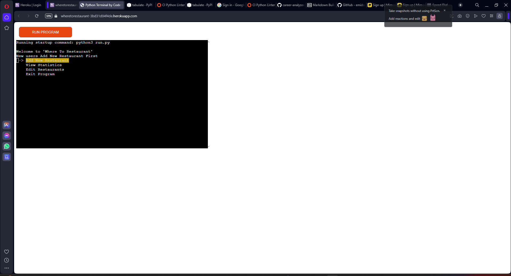 |  | Minor differences |
| repeat for any other tested browsers | x | x | x | x | x |

## Responsiveness

I've tested my deployed project on multiple devices to check for responsiveness issues.

| Device | Home | About | Contact | etc | Notes |
| --- | --- | --- | --- | --- | --- |
| Mobile (DevTools) |  |  |  |  | Works as expected |
| Tablet (DevTools) |  |  |  |  | Works as expected |
| Desktop |  |  |  |  | Works as expected |
| XL Monitor |  |  |  |  | Scaling starts to have minor issues |
| 4K Monitor |  |  |  |  | Noticeable scaling issues |
| Google Pixel 7 Pro |  |  |  |  | Works as expected |
| iPhone 14 |  |  |  |  | Works as expected |
| repeat for any other tested browsers | x | x | x | x | x |

## Defensive Programming

| Page | User Action | Expected Result | Pass/Fail | Comments | Screenshot |
| --- | --- | --- | --- | --- |
| Home | | | | |
| | Enter on Add New Restaurant | Add owner name screen | Pass | 
| | Enter on View Statistics | Check for existing owner screen | Pass | 
| | Enter on Edit Restaurant | Load spreadsheet screen | Pass | |
| | Enter on Exit Program | Exit Program | Pass | |
| Add New Restaurant | | | | |
| | Enter Owner Name | Field will only accept a string with one space, no numbers, no special characters, not none | Pass | 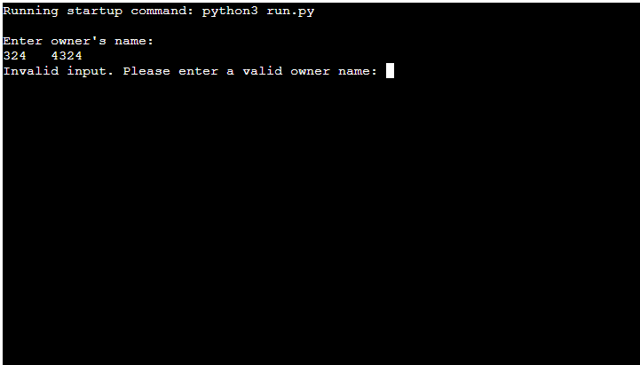 |
| | Zip Code List | Field will only accept a number 1-10 | Pass | 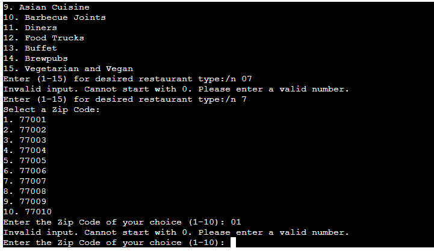 |
| | Restaurant Type List | Field will only accept a number 1-15 | Pass | 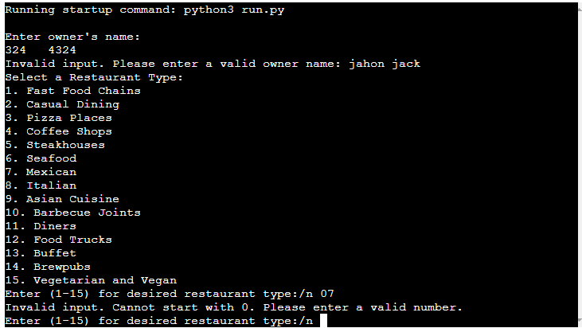 |
| View Statistics | | | | |
| | Enter Owner Name | Field will only an existing Owner Name, a string with one space, no numbers, no special characters, not none | Pass | 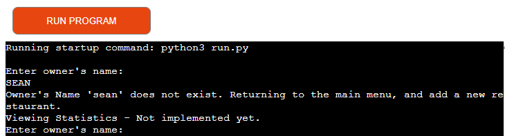 |
| | Zip Code List | Field will only accept a number 1-10 | Pass |  |
| | Restaurant Type List | Field will only accept a number 1-15 | Pass |  |
| | Print Statistics | Field will print statistics | Pass | 
| Edit Restaurant | | | | |
| | Enter Owner Name | Field will only accept an existing Owner Name, a string with one space, no numbers, no special characters, not none | Pass | 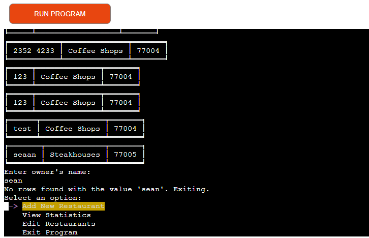 |
| | Edit Options| Field will only accept 1,2,3 | Pass | 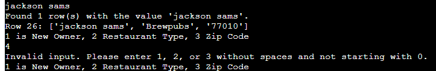 |
| Enter Owner Name Option 1| Field will only accept a string with one space, no numbers, no special characters, not none | Pass |  |
| | Restaurant Type List Option 3 | Field will only accept a number 1-15 | Pass |  |
| | Zip Code List Option 3| Field will only accept a number 1-10 | Pass |  |

## Bugs

- Python `Appending the first input even though it was an invalid input` 

    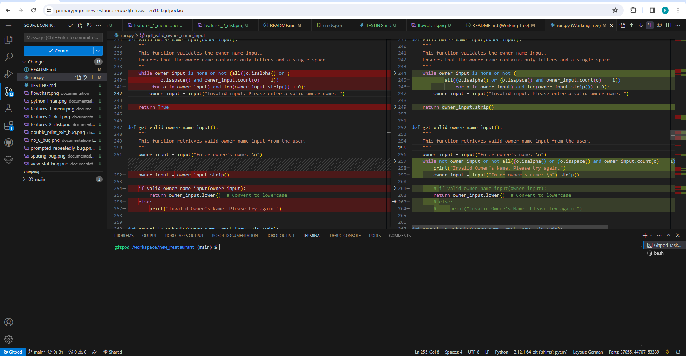

    - To fix this, I combined the Owner validation functions to ensure that the validation works as expected. This was a compbined effort with the help of the Tutor team.

- Python `E501 line too long` (125 > 79 characters)

    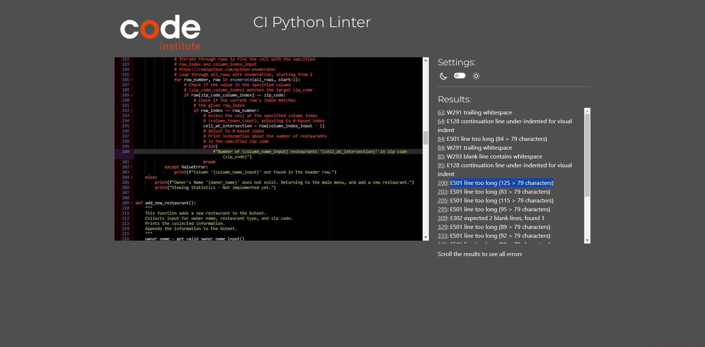

    - To fix this, I separated the "print" into multiple "print" lines.

Python `AttributeError: 'NoneType' object has no attribute 'lower'` 

    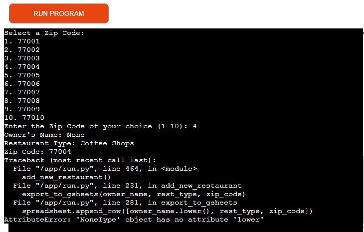

    - To fix this, I made sure there are no extra spaces in the user's input, validate the owner's name, and ensure it's converted to lowercase only when there's a valid input.
    
## Unfixed Bugs

🛑🛑🛑🛑🛑 START OF NOTES (to be deleted) 🛑🛑🛑🛑🛑

You will need to mention unfixed bugs and why they were not fixed.
This section should include shortcomings of the frameworks or technologies used.
Although time can be a big variable to consider, paucity of time and difficulty understanding
implementation is not a valid reason to leave bugs unfixed.

If you've identified any unfixed bugs, no matter how small, be sure to list them here.
It's better to be honest and list them, because if it's not documented and an assessor finds the issue,
they need to know whether or not you're aware of them as well, and why you've not corrected/fixed them.

Some examples:

🛑🛑🛑🛑🛑 END OF NOTES (to be deleted) 🛑🛑🛑🛑🛑

- On devices smaller than 375px, the page starts to have `overflow-x` scrolling.

    

    - Attempted fix: I tried to add additional media queries to handle this, but things started becoming too small to read.

- For PP3, when using a helper `clear()` function, any text above the height of the terminal does not clear, and remains when you scroll up.

    

    - Attempted fix: I tried to adjust the terminal size, but it only resizes the actual terminal, not the allowable area for text.

- When validating HTML with a semantic `section` element, the validator warns about lacking a header `h2-h6`. This is acceptable.

    

    - Attempted fix: this is a known warning and acceptable, and my section doesn't require a header since it's dynamically added via JS.

🛑🛑🛑🛑🛑 START OF NOTES (to be deleted) 🛑🛑🛑🛑🛑

If you legitimately cannot find any unfixed bugs or warnings, then use the following sentence:

🛑🛑🛑🛑🛑 END OF NOTES (to be deleted) 🛑🛑🛑🛑🛑

There are no remaining bugs that I am aware of.
